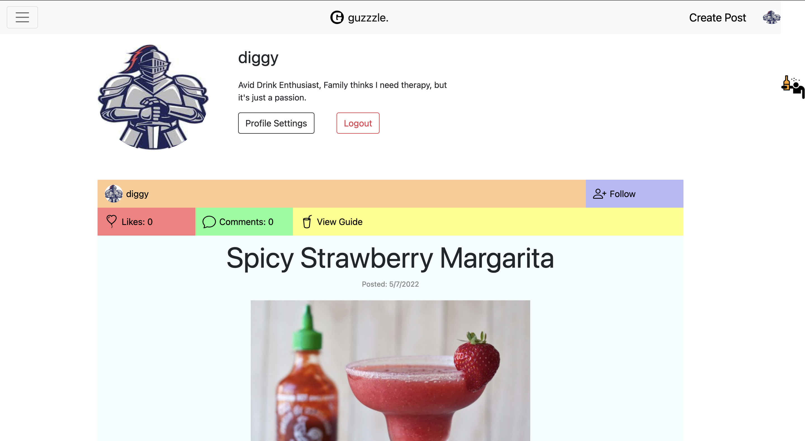
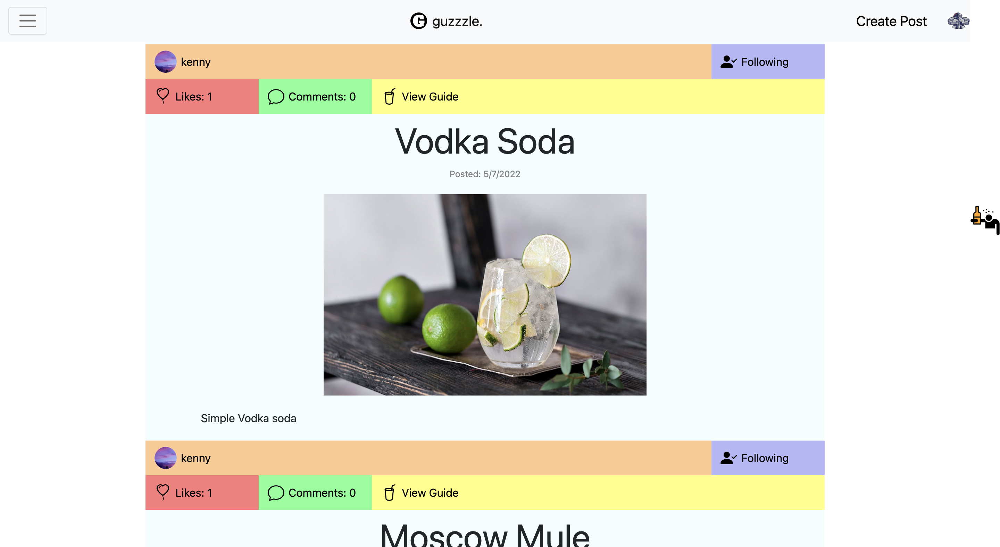
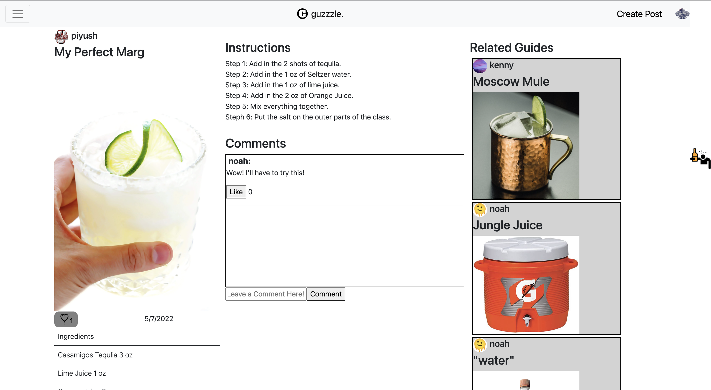

# 326-dubblestuforeo 

### UMass CS326 Final Project - Spring 2022

### [guzzzle.](https://guzzzle.herokuapp.com/)

## Overview  
Our application is called **guzzzle.** (period included). It is *our* take on a social media platform, where users are able to connect 
to one another over the consumption of alcohol. Users of the application are able to create their own pages, or proflies, that house their inteactions 
with the application. This includes the user's posts. Posts, or guides, are user-generated content that are shared across the platform that give instructions 
on how to create alcoholic drinks. This includes everything from as simple as a Gin and Tonic to as complex as a Fat-Washed Mezcal cocktail. Users can interact 
with one another by following each other, liking, commenting or sharing guides. The innovation of this application consists of the ability to search through all of the guides with ease. The applications includes a query feature that allows users to create a list of ingredients they like or have, and upon submission, 
be greeted with a list of the guides that include said ingredients. This enables users to discover new, exiting ways to consume their beloved alcohol. 

## Team Members
Noah Krueger - noahjkrueger  
Diganta Mainali - D-Mainali  
Kenneth Drewry - kendrewry  
Piyush Makkapati - piyushm2001

## User Interface

### LOGIN AND SIGNUP PAGE

This is the login screen, where users can sign up and log in using their newly created username and password.

### PROFILE PAGE

This is an example of a user profile, which consists of profile picture, username, a biography about the user and a stream of all guides the user has ever made and posted.

### FEED PAGE

This is a sample of the main feed, made up of posts that you can comment on, like and users you can follow. The feed is primarily based off of the users you follow, and you can view each post in the feed.

### NAVIGATION PAGE

This is a built-in interface meant to filter your feed page by 5 categories of ingredients: Booze, Juice, Fruit, Vegetable and Garnish. Filtering based on the various types of these main 5 groups will make it so the feed will only show you posts whoich contain the ingredients you selected. One can also search for a specific user if they so desire.

### CREATE AND EDIT POST PAGE

This is the form to fill out if you want to make a post about a recipe. You can post the guides for other users to interact with it. This is also the screen which will be presented if you choose to edit an existing guide.

### GUIDE PAGE

This is the guide page for a specific example post, you can add comments, delete comments, like comments, like the post itself. Follow the ingredients and instructions to make the drink or browse through related guides.

## APIs (TODO)

### Users

#### Login
    guzzzleAPI.login(uid, password)
Will send a GET request to the server to login.
If the UID does not exist, the server will respond with status 404 and a message that UID does not exist.
If the password does not match, the server will respond with status 400 and a message that password was incorrect.
This function saves the uid used to login as the session's uidand returns the user object from the database.
Any other error leads to a 500 error response.
If successful, a 200 status response is returned

#### Logout
    guzzzleAPI.logout()
Will send a GET request to the server to logout.
The session is destroyed and a 200 success response is returned

#### Get Current User
    guzzzleAPI.currentUser()
Will send a GET request to the server.
The server will access the current session's uid (also known as the logged in user) and makes a call to get the user from the database and returns the user object corresponding to the session's uid with a 200 status response.
Any other error leads to a 500 error response.

#### Create a User
    guzzzleAPI.createUser(uid, email, password, pfp)
Will send a POST request to the server to create an account.
If the UID is already in use, the server will respond with status 400 and a message that UID is already taken.
Otherwise, the database will updated with a new entry.
A user object includes:
- uid, the User ID string
- email, the user's email
- password, the password string (unsalted, see "Important Notes")
- profileImage, a string for the image for a user's avatar (a link to the picture)
- biography, a text string
- following, a list of UIDs the user follows
- followers, a list of UIDs that follow the user
- posts, a list of PIDs representing posts the user makes
- likes, a list of PIDS representing the posts the user likes
This function returns the user object as it is stored in the database with a 200 status response is returned
Any other error leads to a 500 error response.

#### Read a User
    guzzzleAPI.readUser(uid)
Will send a GET request to the server to get an account.
If the UID does not exist, the server will respond with status 404 and a message that UID does not exist.
Otherwise, the database will be accessed and a user object with the corresponding uid will be searched for.
A user object includes:
- uid, the User ID string
- email, the user's email
- password, the password string (unsalted, see "Important Notes")
- profileImage, a string for the image for a user's avatar (a link to the picture)
- biography, a text string
- following, a list of UIDs the user follows
- followers, a list of UIDs that follow the user
- posts, a list of PIDs representing posts the user makes
- likes, a list of PIDS representing the posts the user likes
This function returns the user object as it is stored in the database with a 200 status response.
Any other error leads to a 500 error response.

#### Update a User
    guzzzleAPI.updateUser(password, newPassword, newProfileImage, newBiography)
Will send a PUT request to the server to update an account.
The server will access the current session's uid.
If the password is not correct or the result from the database is null, the server will respond with status 400 error message.
Otherwise, the database will be updated so that within the user object corresponding to the session uid:
- password is set to newPassword
- profileImage is set to newProfileImage
- biography is set to newBiography
This function returns the user object that was updated as it is stored in the database with a 200 status response.
All of these fields update on function call, so make sure to pass in all of them! (pass in the original of each if do not wish to update)
Any other error leads to a 500 error response.

#### Delete a User
    guzzzleAPI.deleteUser(password)
Will send a DELETE request to the server to remove an account.
The server will access the current session's uid.
If the password is not correct or the result from the database is null, the server will respond with status 400 error message.
Otherwise, the database will updated to remove the user object with the corresponding uid.
In addition, session uid will be removed from all other users list of following list of followers.
This will be done by calling the next 2 API calls, followUser and unfollowUser
This function responds with status 200 and a message that the deletion was successful.
Any other error leads to a 500 error response.

#### Follow a User
    guzzzleAPI.followUser(uid_to, uid_from)
Will send a PUT request to the server to update both the following and followers lists of the two accounts.
If the password is not correct or the result from the database is null, the server will respond with status 400 error message.
Otherwise, the two uid's following and followers list be updated:
- uid_to is the user that will follow uid_from.
- uid_to's following list will update to include uid_from.
- uid_from's followers list will update to include uid_to.
This function returns the followers list of the user object corresponding to uid_from with a 200 status response.
Any other error leads to a 500 error response.

#### Unfollow a User
    guzzzleAPI.unfollowUser(uid_from, uid_to)
Will send a PUT request to the server to update both the following and followers lists of the two accounts.
If the password is not correct or the result from the database is null, the server will respond with status 400 error message.
Otherwise, the two uid's following and followers list be updated:
- uid_to is the user that will follow uid_from.
- uid_to's following list will update to remove uid_from.
- uid_from's followers list will update to remove uid_to.
This function returns the user object corresponding to uid_from with a 200 status response.
Any other error leads to a 500 error response.

#### Getting a User Feed
    guzzzleAPI.getFeed()
The server will access the current session's uid and get the user that corresponds with it from the database.
The feed is based on a user's following and returns user objects whose posts will be used as the data for the stream.
If either the session uid does not exist or the user object retrieved is null, it returns a default feed (user objects).
Otherwise, we will retreive the session uid's user object's following's user_object's posts, to be used for the feed
This function will thus return a list of post objects authored by users that the session uid's user object follows.
If successful, a 200 status response is returned
Any other error leads to a 500 error response.

### Posts
#### A Note about ingredient_keys
ingredient_keys is an array stored in a post object. These are used to index posts for querying. They do not include specific brands or measurements.
For example, if a post included 'Tito's vodka', the ingredient key should be 'Vodka'. Same goes for other ingredients. If an ingredient is not listed (aka niche ingredients), please do not include it as it will not be indexed. The purpose of this is to keep the queries general and limited to the options the site offers.

#### Create a Post
    guzzzleAPI.createPost(title, image, ingredient_keys, ingredients, instructions, description)
Will send a POST request to the server to create a post.
The server will access the current session's uid.
If the retrieved user object corresponding to the session's uid equates to null, it means no user is logged in, thus a response with status 400 will be returned with a message saying exactly that.
A new pid is automatically generated and in included in the creation of the post.
A post object includes:
- uid, the user ID that created the post
- pid, the post ID number integer
- title, a string that is the post title
- image, the image included in the post
- description, a string that is the post description
- ingredient_keys, an array of ingredients used to index the post within index
- ingredients, a string of ingredients, including brands and measurements that is displayed on post
- instructions, a string of the instructions to be included on the post.
- likes, the number of likes the post has, initialized to 0
- comments, a list of objects containing 4 keys: uid, cid, comment and likes initalized to an empty array
- date, the date the post was created
ingredient_keys is used to modify the index to include the created post.
This function returns the post object that was created as it is stored in the database with a 200 status response
Any other error leads to a 500 error response.

#### Read a Post
    guzzzleAPI.readPost(pid)
Will send a GET request to the server to read a post.
If the PID does not exist, the server will respond with status 404 and a message that PID does not exist.
Otherwise, the post object corresponding to the pid will be accessed from the database.
A post object includes:
- uid, the user ID that created the post
- pid, the post ID number integer
- title, a string that is the post title
- image, the image included in the post
- ingredient_keys, an array of ingredients used to index the post within index
- ingredients, array of strings of ingredients, including brands and measurements that is displayed on post
- instructions, a string of the instructions to be included on the post.
- likes, the number of likes the post has
- comments, a list of objects (UID, comment values)
- date, the date the post was created
This function returns the post object that was searched for and retrieved from the database with a 200 status response
Any other error leads to a 500 error response.

#### Read Other Posts
    guzzzleAPI.readOtherPosts(pid)
Will send a GET request to the server to read and collect multiple posts.
This function returns an array of pids representing posts which are posted by the same author except for the current post. This is done by retrieving post object correpsonding to the pid from the database, accessing the post objects uid, and using that uid to get a user object from database and append all of the pids in the user objects pid field except for the one passed in to a list. This list is returned with a 200 status response
This return value is the used as one of the components that factors into the algoritm for finding related Guides for the guide page. Any error leads to a 500 error response.

#### Update a Post
    guzzzleAPI.updatePost(pid, newTitle, newImage, newIngredient_keys, newIngredients, newInstructions, newDescription)
Will send a PUT request to the server to update a post. Post object is retrieved via pid from the database.
If the retrieved post object's uid does not match the session's uid, the server will respond with status 400 due to the session uid not being the owner of the post.
Otherwise, the database will be updated so that within the post object:
- title is set to newTitle
- image is set to newImage
- ingredient_keys is set to newIngredient_keys
- ingredients is set to newIngredients
- instructions is set to newInstructions
- description is set to newDescription
ingredient_keys is used to modify the index to include the created post as well as remove ingredients no longer included, before ingredient_keys is updated.
This function returns the post object that was updated as it is stored in the database.
If the returned value is null, then the server will respond with status 400 due to an error while updating.
All of these fields update on function call, so make sure to pass in all of them! (pass in the original of each if do not wish to update)
Any other error leads to a 500 error response.
If successful, a 200 status response is returned

#### Delete a Post
    guzzzleAPI.deletePost(pid)
Will send a DELETE request to the server to remove an account. Post object is retrieved via pid from the database.
If the retrieved post object's uid does not match the session's uid, the server will respond with status 400 due to the session uid not being the owner of the post.
This function returns the post object that was updated as it is stored in the database.
If the returned value is null, then the server will respond with status 400 due to an error while deleting
Otherwise, the database will be updated to remove the post entry and also remove the pid from the post authors post list.
Any other error leads to a 500 error response.
This function responds with status 200 and a message that the post was deleted.

#### Like a Post
    guzzzleAPI.likePost(pid)
Will send a PUT request to the server to update the likes on a post. The server will access the current session's uid.
The session uid is used to retrieve it's user object from the database. If the user object is null, a 400 status response results in an error message saying login is required to like a post.
Otherwise, the database will updated so that the pid's post object has its likes increased by 1.
The user object tied to the session's uid will have the like recorded.
This function returns the post object that was updated as it is stored in the database with a 200 status response
Any other error leads to a 500 error response.

#### Unlike a Post
    guzzzleAPI.unlikePost(pid)
Will send a PUT request to the server to update the likes on a post. The server will access the current session's uid.
The session uid is used to retrieve it's user object from the database. If the user object is null, a 400 status response results in an error message saying login is required to unlike a post.
Otherwise, the database will updated so that the pid's post object has its likes decreased by 1.
The user object tied to the session's uid will have the like unrecorded.
This function returns the post object that was updated as it is stored in the database with a 200 status response
Any other error leads to a 500 error response.

### Querying the Index
    guzzzleAPI.queryPosts(ingredients)
Will send a GET request to the server with a list of ingredients as a parameter.
When passed in a list of ingredients, this function will accumulate posts under each ingredient index. 
This function returns a object with PID keys mapping to integers. The higher the integer, the more frequent the post
showed up within the index with respect to the ingredients passed in. This enables one to extract PIDs that are most
relevant to the query, then use those PIDs to retrive posts (see "Read a Post").
If there are no matching ingredients, it will respond in a 404 status error, any other error a response status of 500.
If successful, a 200 status response is returned.

### Comments
#### Comment on a Post
    guzzzleAPI.commentPost(pid, comment)
Will send a PUT request to the server to create a comment on a post. The server will access the current session's uid.
The session uid is used to retrieve it's user object from the database. If the user object is null, a 400 status response results in an error message saying login is required to comment on a post.
The pid is used to retrieve the post object and a new cid (comment identifier) is generated.
Otherwise, The new comment will be created and pushed into the list of existing comments retrieved from the database. The list  will then be sorted and set as the new comments list for the post object in the database.
A comment object includes:
- uid, the uid of the user commenting (login)
- cid, the unique comment identifier for that specific post
- comment, the comment which is to be commented
- likes, an array holding uid's of users who likes the post
To be noted: The Author of a comment can delete their post but cannot like their post.
This function returns the cid of the comment that was created and added to the database with a 200 status response

#### Get Comments of a Post
    guzzzleAPI.getComments(pid)
Will send a GET request to the server to read all the comments on a particular post.
The pid is used to retrieve its corresponding post object from the database.
The comments are accessed from the post object.
This function returns the comments to display in the browser with a 200 status response
To be noted: The comments are sorted by highest liked to lowest liked top to bottom.
Any error leads to a 500 error response.

#### Get a Specific Comment of a Post
    guzzzleAPI.getComments(pid, cid)
Will send a GET request to the server to read a specific comment on a particular post.
The pid is used to retrieve its corresponding post object from the database.
The specific comment is accessed from the post object using and the cid (comment identifier).
This function returns the comment with a 200 status response, Any error leads to a 500 error response.

#### Delete a Comment
    guzzzleAPI.commentDelete(pid, cid)
Will send a DELETE request to the server to delete a comment on a particular post.
The pid is used to retrieve its corresponding post object from the database.
The specific comment is accessed from the post object using and the cid (comment identifier).
The found comment is spliced out of the comment list, which is then resorted by likes and then set as the new comment list of the post object in the database, essentially deleting the comment.
This function returns 1 with a 200 status response, any error leads to a 500 error response.

#### Check if Comment Liked
    guzzzleAPI.checkCommentLike(pid, cid)
Will send a GET request to the server to check if the logged in user has liked a specific comment.
The server will access the current session's uid. The pid is used to access the post object from the database and then the comments of the post object is looped through until one with the matching cid (comment identifier) is found.
By then checking if the uid exists within the likes list of the specific comment, we can return a boolean value.
This function returns True if uid is in the likes list, else false, and any error leads to a 500 error response.
If successful, a 200 status response is returned

#### Like a Comment
    guzzzleAPI.likeComment(pid, cid)
Will send a PUT request to the server in order to like a specific comment. The server will access the current session's uid.
The pid is used to access the post object from the database and then the comments of the post object is looped through until one with the matching cid (comment identifier) is found. It then adds the session's uid to the found comments likes list, resorting the list, and setting the updated list as the likes field for the comment in the database.
This function returns 1 with a 200 status response and any error leads to a 500 error response.

#### Unlike a Comment
    guzzzleAPI.unlikeComment(pid, cid)
Will send a PUT request to the server in order to like a specific comment. The server will access the current session's uid.
The pid is used to access the post object from the database and then the comments of the post object is looped through until one with the matching cid (comment identifier) is found. It then removes the session's uid to the found comments likes list, resorting the list, and setting the updated list as the likes field for the comment in the database.
This function returns 1 with a 200 status response and any error leads to a 500 error response.

## Database
Our application uses MongoDB. We use one cluster. A description of each collection is below.

### Users Collection
    document user {
        _id: <ObjectID>,
        uid: String,
        email: String,
        password: String,
        profileImage: String, 
        biography: String, 
        posts: Array<Integer>, 
        following: Array<String>,
        followers: Array<String>, 
        likes: Array<Integer>
    }
A user document includes the following that allows for user to user and user to post interaction:
- A list of UIDs that the user follows
- A list of UIDs that follow the user
- A list of PIDs that the user has posted
- A list of PIDs that the user has liked

### Posts Collection
    document post {
        pid: Integer,
        uid: String,
        title: String, 
        image: String, 
        date: String, 
        likes: Integer, 
        ingredient_keys: Array<String>, 
        ingredients: String, 
        instructions: String, 
        description : String, 
        comments: Array<Object>
    }
A post document includes the followinf that allows for user to post interaction:
- A list of comment objects that house comments on the post
- A count of likes the post has
- A list of keys used for querying posts

## URL Routes/Mappings

### /currentuser

Gets the current user. User must be logged in.

### /login

Logs the user in. User must use a username and password to log in.

### /logout

Logs the user out. User must be logged in.

### /user_create

Creates a new user. Must be created using a username and password.

### /user

Gets a specific user's page. Used when clicking someone's profile.

### /user_update

Allows the user to update their password, biography, or profile image. User must be logged in and supply the password of their account.

### /user_delete

Allows the user to delete their account. The user must be logged in and must supply the password of their account.

### /post_create

Allows the user to create a new post. The user must be logged in.

### /post

Gets a specific post's page. 

### /post_update

Allows the user to update thier post. Must be logged into the account that owns the post.

### /post_delete

Allows the user to delete their post.

### /query

Gets a specific search query, shows the posts that match the query.

### /feed

Gets a users feed based on their following. The user must be logged in, otherwise the default feed will show.

### /like

Allows a user to like a specific post. User must be logged in, and not previously liked the post.

### /unlike

Allows a user to unlike a specific post. The user must be logged in, and must have liked the post already.

### /follow

Allows a user to follow another user. The user must be logged in.

### /unfollow

Allows a user to unfollow another user. The user must be logged in.

### /comment

Allows the user to comment on a specific post. The user must be logged in.

### /comments_get

Gets the comments of a specific post.

### /comment_delete

Allows the user to delete their own comment. User must be the author of the comment and logged in.

### /comment_check

Checks if the user has liked a comment

### /comment_like

Allows a user to like a comment. The user must be logged in.

### /comment_unlike

Allows a user to unlike a comment. The user must be logged in and have already liked the post.

## Authentication/Authorization

All visitors of the application are able to:
- View a post
- Query guides
- Find user pages
- Create an account
- Log in to an account  

If a user is logged in, they will have a session. When there is a valid session, the user has additional privledges:
- Like posts
- Comment on posts
- Follow other users 
- Create posts  

In addition, post/guide pages and user pages that are owned by the user have accsess to buttons that enable certian features. These include:
1. Post pages a logged in user owns:
    - Edit Post button
        - Changing the title of a post
        - Changing the ingredients of a post
        - Changing the description of a post
        - Changing the instructions of a post
        - Changing the image of a post
    - Delete Post button
        - Remove the post from the application
2. The logged in user's page:
    - Edit Profile button
        - Change the image of a profile
        - Change the biography of a profile
        - Change the password of a profile
        - Delete a profile

## Division of labor

### Noah Krueger

- Laid out structure of application
    - Organization of files
    - How posts are represented
    - How users are represented
    - How posts are queried
    - Wireframes for each page
    - How the application is navigated
    - How data is introduced to specific pages
- Created the navigation bar
    - Logic to show 'Login/Signup' vs a logged in user's profile picture
    - Created the logo featured in navigation bar
    - Created application name
    - Implimented logic of user search bar
    - Implimented logic of post search form
        - Implimented results page
            - Logic of result ordering
    - Styling (CSS) of the navbar, modal, form (including the icons)
- Created the feed
    - Feed is used on main page, each profile page and search results
    - Logic on how to get appropriate feed
        - Profile feed only has the user's posts
        - Result feed has all results that include parts of the form
        - Main feed only has posts from the user's following list
    - Logic on how to order the feed
        - By posting date for profiles and main feed
        - By ingredient keys for search results
    - Logic on icon display for likes / follow user on each post
    - Styling (CSS) of the feed
- Enabled seessions
    - Creating sessions on login
    - Destroying sessions on logout
    - Expiring sessions
    - Logic of displaying buttons on certian pages with respect to the logged in user
- Created API function calls and endpoints for:
    - Login, Logout
    - CRUD operations
        - For Users
        - For Posts
    - Like, unlike post
    - Follow, unfollow user
    - Querying posts
    - Getting feeds
- Created Database operations for:
    - Login, Logout
    - CRUD operations
        - For Users
        - For Posts
    - Querying posts
    - Getting feeds
- Enabled upload of images via base64 conversion
- Many bug fixes regaurding implimentations and smoothing transistions between parts of application and visual design (CSS)
- Set up Atlas DB
- Heroku Configs
- setup.md
    - Wrote detailed instructions
- ideas.md
    - Created and wrote ideas
- milestone1.md
    - Created wireframes
    - Wrote text included
- milestone2.md
    - Documented API calls one-to-one with calls created (see above)
- milestone3.md
    - Documented the structure of the database
- final.md
    - Overview, Database, Authentication/Authorization
- Final Video
    - Contributed to final video

### Diganta Mainali

- Created the Guide Page
    - Utilizes a render function to render content into a design of 3 columns
        - First Column: Profile Picture, Username, Title, Image, Likes, Date, Ingredients
        - Second Column: Instructions, Comments
        - Third Column: Related Guides with Profile Pictures, Usernames, Titles and Image Thumbnails
    - Constructed and Streamlined Comment Liking and Comment Deletion functionality
        - Designed scrollable comment box, message input box and comment button
        - Added ability to create a comment
        - Added ability to delete a comment
        - Added ability to like a comment
        - Added ability to unlike a comment
        - Developed functionality that post authors cannot comment on their own post
            - input box and comment button only appear when the user in session is not on a post they themselves made
        - Developed functionality of alternating buttons
            - If user in session has not liked a comment, a button with "Like" appears
            - If user in session has liked a comment, a button with "unLike" appears
            - These buttons alternate without refresh
            - Like count is persistantly updated without refresh
        - Developed functionality that comment authors cannot like their own comments
            - Comment Like and Unlike button only shows up for users who did not create the comment
        - Developed functionality surrounding the comment author
            - Only the comment author has the delete button available to them
            - While comment author cannot like/unlike their own post, the like count is still visible to them
    - Created an Algorithm to display related guides
        - Collects posts to display from 3 sources
            - The user in session's following's posts
            - The post author's following's posts
            - The post author's posts
        - Developed functionality to not include repeats
            - Excluded current viewed post when finding user in session's following's posts
            - Excluded current viewed post when finding post author's posts
            - When combining all 3 sources into one list, ensure list does not already contain a pid about to be added
        - Added a cap on how many related guide posts appear
            - Programmed random whole number Generator
                - returns 3 numbers from a range min to max
                - designed to ensure all 3 numbers are unique
            - if <= 3 results in list created from algorithm, display all
            - if > 3 results
                - utilize random whole number generator from range 0 to length of results - 1 to get list of 3 random numbers
                - use those 3 numbers as indexes of the result list to find the 3 related guides to display
- Created/Developed API function calls and endpoints for:
    - For Posts
        - Reading a Users Other Posts
    - For Comments
        - Creating and Deleting Comments
        - Getting All of the Comments of a Particular Post
        - Getting a Specific Comment of a Particular Post 
        - Checking if a Comment has Been Liked by the User in Session
        - Liking and Unliking Comments
- Contributed Discourse in team meetings
    - Assisted in contemplating next steps
    - Brought up relevant design choices
    - Weighed pro/cons of possible changes/alterations 
- Bug fixes / Error checking
    - Code cleanup primarily in the Guide page
- Resolved errors surrounding guide page's and feed's liking and feed's following functionality
- Took screenshots and wrote up the User Interface for milestone 2 
- Described all Comment CRUD operations in the API section for milestone 2
- Took screenshots and wrote up the User Interface for final.md
- Described all 21 CRUD operations in the API section for final.md
- Code Cleanup, spell checking and whitespace reorganization overall
- Database testing and final setup
- Final Video work
    

### Kenneth Drewry

- made create_guide page
- release for milestone 2
- Complete overhaul of create guide page
- Added API call to createPost when creating a new post
- Edited createPost and updatePost APIs
- Created and added master ingredient list to navigation bar
- Wrote setup.md for milestone2
- Implemented Database calls for Like and Unlike of posts.
    - Includes restructure of functions/calls in index.js
    - Changed feed.js and get_guide.js to display like count correctly when updated        
- Added Create Post button in navbar
- Bug fixes / Error checking
- Code cleanup
- Wrote URL endpoints in final.md
- Edited and Uploaded final video

### Piyush Makkapati

- made login page
    - Login and Signup work # need a proper email to sign up
- Used API to correctly display the right profile when view profile is clicked
- Got rid of the hard coded profile html and turned it into JS
- Deployed app into Heroku originally
- Implemented Database calls for Follow and Unfollow of users. 
    - Changed around the function/parameters in index.js for manageFollow
    - Needed to change around the following/ unfollowing section in feed.js to correctly follow and unfollow an user.
- Couple small bug fixes here and there for the db file.
- Deployed the fully merged branched onto Heroku to keep the website up to date
- Wrote the conclusion in final.md 

## Conclusion

Our team's experience in working on this project has been very productive. Every member of the team communicates with another easily without any problems. We believe that we efficiently used the concepts taught in class to implement our website the way we wanted it to function. We had difficulties with keeping the passwords of users safe, rendering the pages, cookies, and some API/Mongodb functionality at first. We worked together as a team and got rid of the issues. Knowing about Heroku and MongoDB before starting the project would have helped a decent amount because these were the things that needed to be learned quickly in order to connect everything together. It would have been better to know ahead of time so that the implementation could be same throughout instead of changing it at the end.
