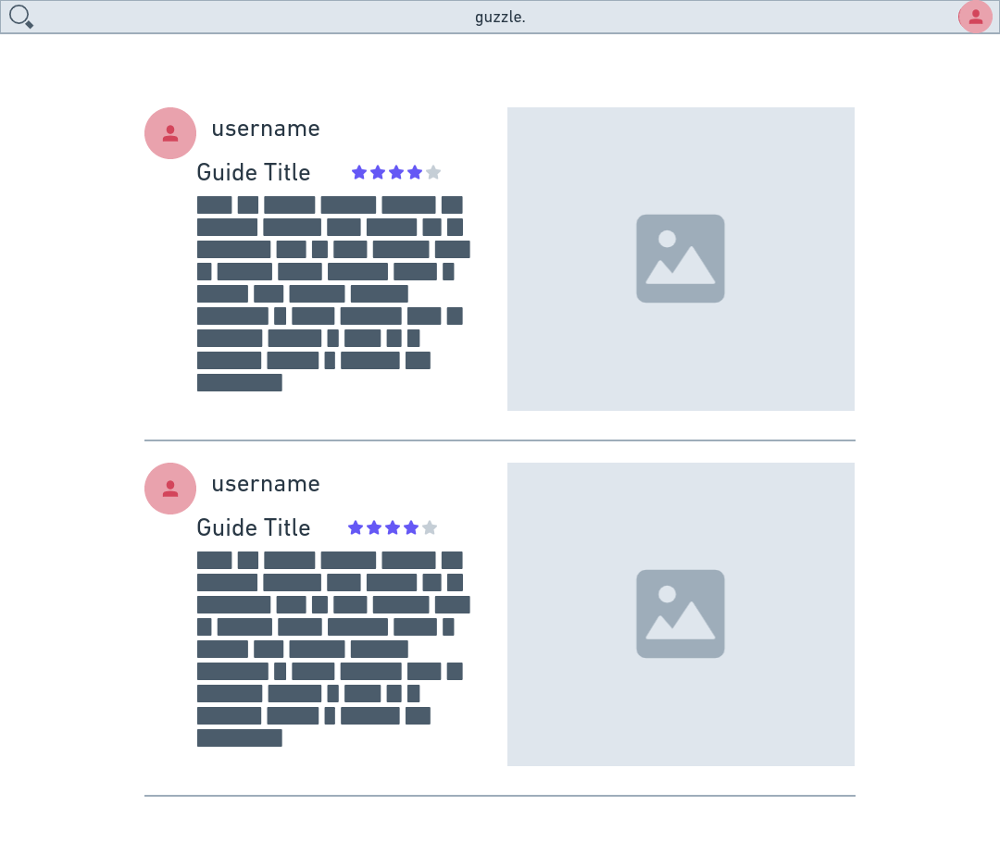
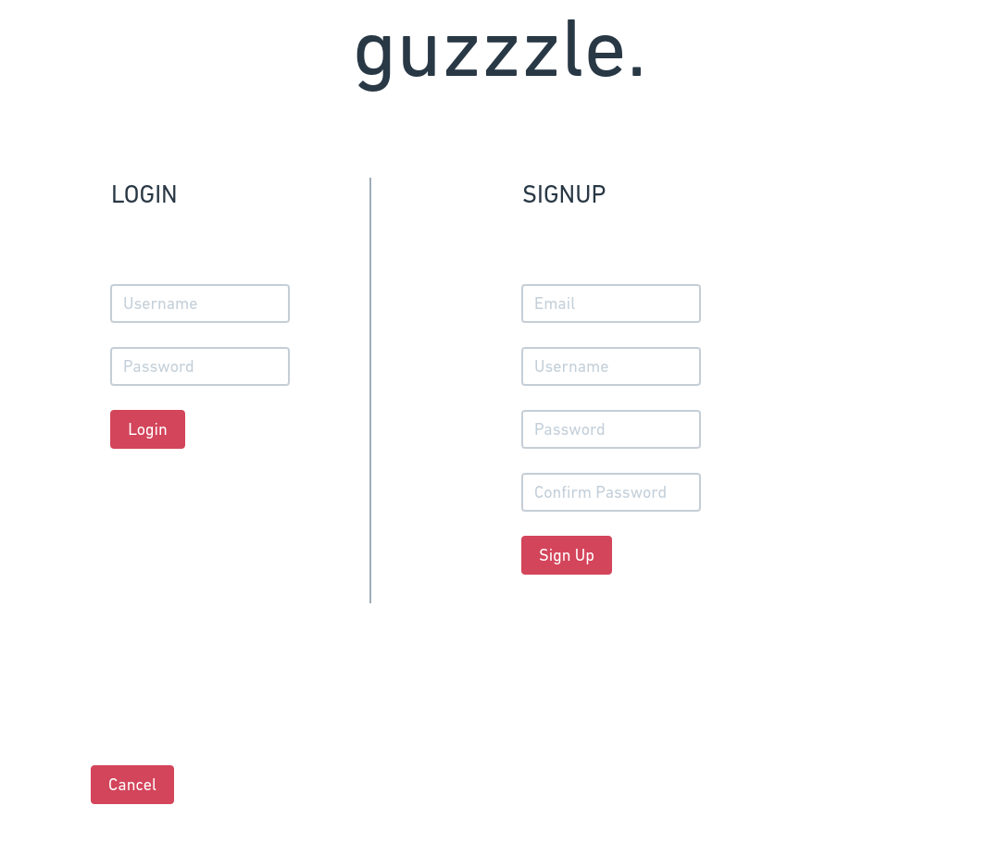

# 326-dubblestuforeo  
## guzzzle.
### Team Overview  
Noah Krueger - noahjkrueger  
Diganta Mainali - D-Mainali
Kenneth Drewry - kendrewry  
Piyush Makkapati - piyushm2001  
### Our Innovative Idea  
Our idea is to create a cocktail/drink recipe guide social media hybrid.
### Important Components / Data Interaction
1. Recipe Query
    - Users will be able to give a list of ingredients they have/like and be presented with a list of cocktails/drinks they can make.
    - Can retrive recipies that only include given ingredients, or recipies with those ingredients in them.
    - User generated guides/recipies will be included in this list (see point 2), ranked by popularity.
2. User Made Guides
    - Guides can be commented on, liked, shared and 'forked'.
    - 'Forked' guides are modifications to preexisting guides and are slight variations of such. 
        - This allows users to add their own personality to a guide.
        - Popular forked guides will be listed on the preexisting guide.
3. User Feeds
    - Users can 'follow' one another, thus being notified of content a user puts out.
    - Users will be reccomended guides based on previous liked guides
    - Users not logged in will be presented with popular sitewide guides
4. User Profiles
    - Users will have profiles that include their guides, images of drinks they have and/or made, or other text posts.
    - Users will have their own unique usernames and can upload a profile picture
### Wire Frames

#### Home/Feed Page (index)

- This page will be similar for users that are logged in and for users that are not logged in.
- Each type of user can navigate to the Guide Query page on the top left of the feed.
- Logged in user:
    - Feeds will display a mix of pupular guides and guides / posts from users they follow.
    - Can navigate to their personal profile by clicking their image in the top right of screen.
- Unlogged in user:
    - Feed will display only popular guides from the site.
    - Login/Signup button is in place of top right profile picture.
- Users can navigate to a guide page by clicking a guide in their feed (see Guide Page)
- Users can input a list of ingrediant or look up the name of a guide.
- Returns a feed or related results to their feed.

#### Guide Page

- From the feed or query, a user can navigate to a guide page.
- Guide pages can be liked, commented on, shared, or modified (forked)
- Can navigate to the user who posted profile page (see User Profile Page)
- Will reccomend similar guides / popular forks

#### Login / Signup Page

- Users can navigate to this page from the home/feed page if they are not logged in.
- Option to log into existing account or create a new account.

#### Content Creation Page

- Can be acsessed from the user's profile page (see User Profile Page)
- A template for users to create a guide / post
- Guide posts: A template  will ask a user for ingredient lists, an image of the made drink, instructions on how to make said drink.
- Text/image posts : A non guide post that can be interacted in the same way as guide pages.

#### User Profile Page

- If a user is loggged in, this will show their profile. Otherwise, It displays the Login/Signup page
- Displays a user's biography, profile images and posts.
- The owner of the page can create a guide here, logout, or otherwise modify the profile.
- Can 'follow' a user if logged in and veiwing another user's page.
