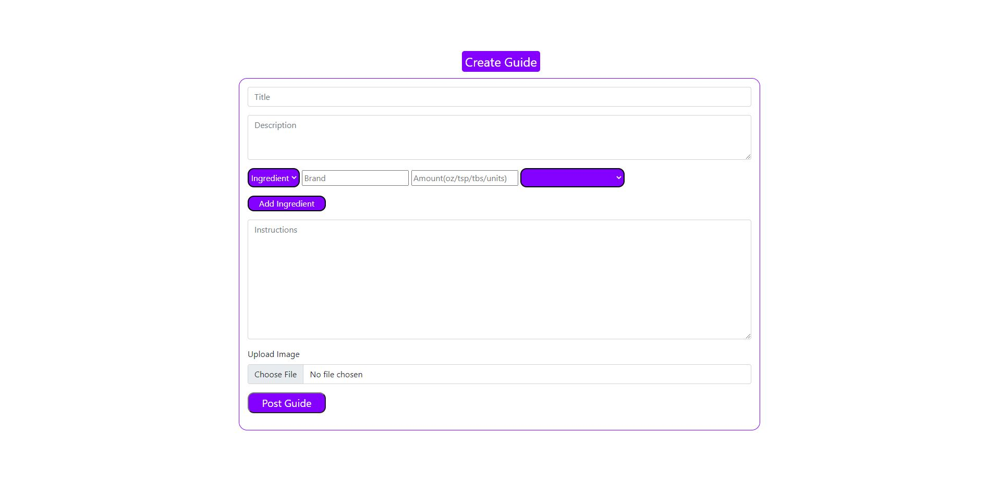
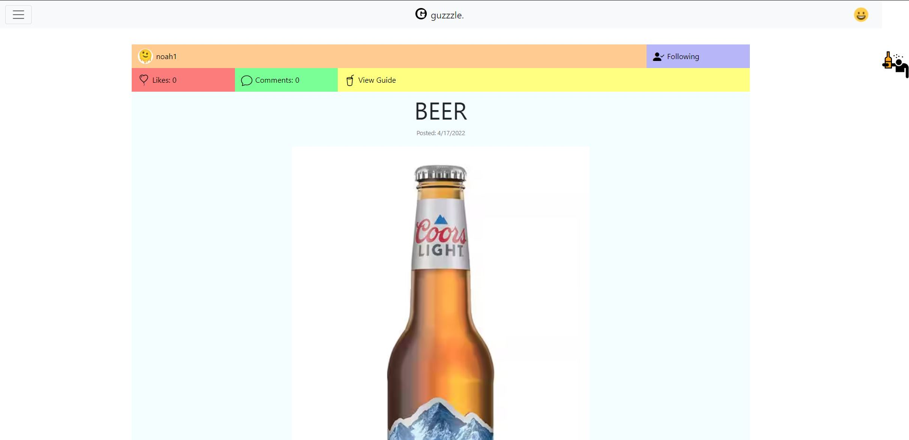
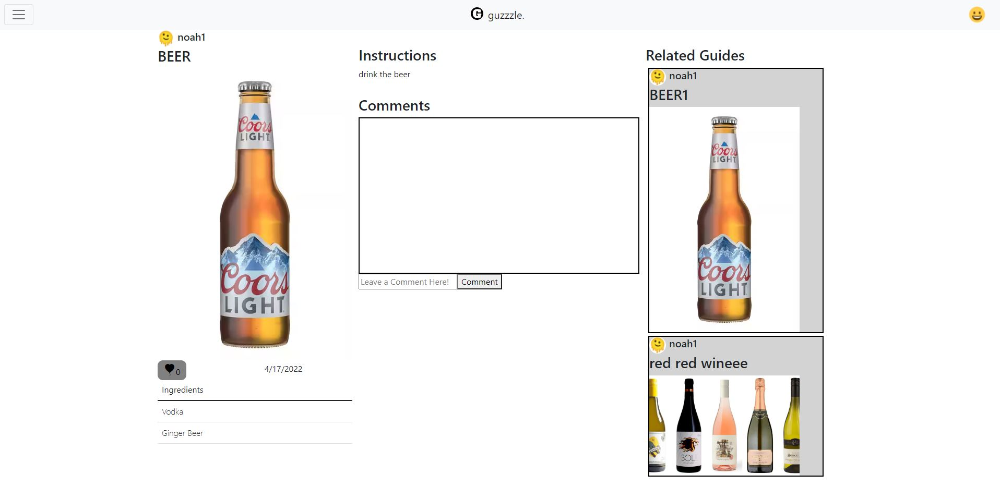
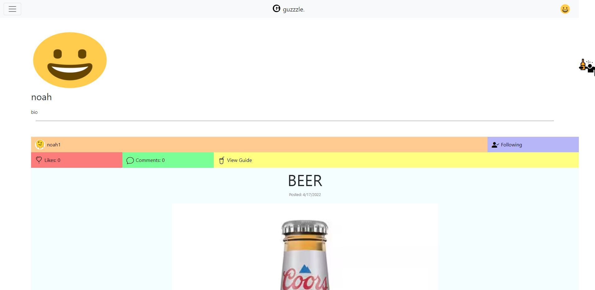

# 326-dubblestuforeo  
## guzzzle.
### Team Overview  
Noah Krueger - noahjkrueger  
Diganta Mainali - D-Mainali
Kenneth Drewry - kendrewry  
Piyush Makkapati - piyushm2001

### Division of labor
#### Noah Krueger
Feed and Navigation work
API for posts and users CRUD operations
Indexing posts for search
Other styling work
#### Diganta Mainali
Transferred from constant based rendering to rendering based off of nodeJS server requests in guide page
Utilized API calls for posts and users to recieve information needed for automating the rendering
Wrote all API CRUD calls pertaining to comments alongside one to read a user's and user's follower's posts other than the viewed
Wrote descriptions of all the API CRUD operations I implemented
Added in screenshots of client Interface as well as descriptions
#### Kenneth Drewry
Complete overhaul of create guide page
Added API call to createPost when creating a new post
Edited createPost and updatePost APIs
Created and added master ingredient list to navigation bar
Wrote setup.md
#### Piyush Makkapati
Login and Signup work
Used API to correctly display the right profile when view profile is clicked
Made it so the user must include a valid email in order to sign up and create an user that gets saved in users.json
Got rid of the hard coded profile html and turned it into JS
Deployed app into Heroku

### Screenshots of Client Interface

This is the login screen, where users can sign up and log in using their newly created username and password.

This is the form to fill out if you want to make a post about a recipe. You can post the guides for other users to interact with it.

This is the main feed, made up of posts that you can comment on, like and users you can follow. The feed is primarily based off of the users you follow, and you can view each post in the feed.

This is the main page for a specific post, you can add comments, delete comments, like comments, like the post itself, follow the ingredients and instructions to make the drink or browse through related guides.

This is the user profile, which consists of profile picture, username, a biography about the user and a stream of all guides the user has ever made and posted.

### Heroku Link to Project
https://guzzzle.herokuapp.com/

### The guzzzleAPI
Using this API allows for creation, reading, updating and deleting posts and users.
With additional request support for commenting on a post, liking/unliking a post, follow/unfollowing a user,
and querying posts, use of the API allows for full functionality of a social network.

### Important Notes
This API does not salt passwords (i.e. in the current version, passwords are stored as plain text within the users.json file), so
please do not create an account with a legitimate password (one you might use normally).
There is also no cookie checking in the current state. This means that anyone is able to send requests via the browser URL
to create, delete, or modify both user accounts and posts. This also allows for infinite likes, if one is so inclined.

### Getting Started with guzzzle. API
With the guzzzleAPI.js file within the same directory, use:
    import * as guzzzleAPI from './guzzzle-api.js'

#### Users
##### Login
    guzzzleAPI.login(uid, password)
Will send a GET request to the server to login.
If the UID does not exist, the server will respond with status 404 and a message that UID does not exist.
If the password does not match, the server will respond with status 400 and a message that password was incorrect.
This function returns the user object as it is stored in users.json.
##### Create a User
    guzzzleAPI.createUser(uid, password, profileImage, biography)
Will send a POST request to the server to create an account. 
If the UID is already in use, the server will respond with status 400 and a message that UID is already taken.
Otherwise, the users.json file will update with a new entry.
A user object includes:
- uid, the User ID string
- password, the password string (unsalted, see "Important Notes")
- profileImage, a string for the image for a user's avatar (a link to the picture)
- biography, a text string
- following, a list of UIDs the user follows
- followers, a list of UIDs that follow the user
- posts, a list of PIDs representing posts the user makes
This function returns the user object as it is stored in users.json.
##### Read a User
    guzzzleAPI.readUser(uid)
Will send a GET request to the server to get an account.
If the UID does not exist, the server will respond with status 404 and a message that UID does not exist.
Otherwise, the users.json will be acsessed.
A user object includes:
- uid, the User ID string
- password, the password string (unsalted, see "Important Notes")
- profileImage, a string for the image for a user's avatar (a link to the picture)
- biography, a text string
- following, a list of UIDs the user follows
- followers, a list of UIDs that follow the user
- posts, a list of PIDs representing posts the user makes
This function returns the user object as it is stored in users.json.
##### Update a User
    guzzzleAPI.updateUser(uid, newPassword, newProfileImage, newBiography)
Will send a PUT request to the server to update an account. 
If the UID does not exist, the server will respond with status 404 and a message that UID does not exist.
Otherwise, the users.json file will update the entry so that within the user object:
- password is set to newPassword
- profileImage is set to newProfileImage
- biography is set to newBiography
All of these feilds update on function call, so make sure to pass in all of them! (pass in the original of each if do not wish to update)
This function returns the user object that was updated as it is stored in users.json.
##### Delete a User
    guzzzleAPI.deleteUser(uid)
Will send a DELETE request to the server to remove an account.
If the UID does not exist, the server will respond with status 404 and a message that UID does not exist.
Otherwise, the users.json file will update to remove the entry.
In addition, the users following UID will have uid removed from both the followers and following lists.
This function responds with status 200 and a message that the user was deleted.
##### Follow a User
    guzzzleAPI.followUser(uid_from, uid_to)
Will send a PUT request to the server to update both the following and followers lists of the two accounts.
If the UID does not exist, the server will respond with status 404 and a message that UID does not exist.
Otherwise, the users.json file will update the entry.
- uid_from is the user that will follow uid_to.
- uid_from following list will update to include uid_to.
- uid_to following list will update to include uid_from.
This function returns the user object that ilicited the update, (i.e. uid_from) as it is stored in users.json.
##### Unfollow a User
    guzzzleAPI.unfollowUser(uid_from, uid_to)
Will send a PUT request to the server to update both the following and followers lists of the two accounts.
If the UID does not exist, the server will respond with status 404 and a message that UID does not exist.
Otherwise, the users.json file will update the entry.
- uid_from is the user that will unfollow uid_to.
- uid_from following list will update to remove uid_to.
- uid_to following list will update to remove uid_from.
This function returns the user object that ilicited the update, (i.e. uid_from) as it is stored in users.json.
##### Getting a User Feed
    guzzzleAPI.getFeed(uid)
Will send a GET request to the server to retrive a list of posts from the UIDs following list.
If the UID does not exist, the server will respond with status 404 and a message that UID does not exist.
Otherwise, the users.json will be acsessed.
This function returns a list of PIDs from users that UID follows.

#### Index
The index is used to query posts. It is an inverted index that maps ingredients to posts. This data structure is modified by functions
under the 'Posts' section.
##### Querying the Index
    guzzzleAPI.queryPosts(ingredients)
When passed in a list of ingredients, this function will accumulate posts under each ingredient index. 
This function returns a object with PID keys mapping to integers. The higher the integer, the more frequent the post
showed up within the index with respect to the ingredients passed in. This enables one to extract PIDs that are most
relevant to the query, then use those PIDs to retrive posts (see "Read a Post").

#### Posts
##### A Note about ingredient_keys
ingredient_keys is an array stored in a post object. These are used to index posts for querying. They do not include specific brands or measurements.
For example, if a post included 'Tito's vodka', the ingredient key should be 'Vodka'. Same goes for other ingredients. If an ingredient is not listed (aka niche ingredients), please do not include it as it will not be indexed. The purpose of this is to keep the queries general and limited to the options the site offers.
##### Create a Post
    guzzzleAPI.createPost(uid, title, image, description, ingredient_keys, ingredients, instructions)
Will send a POST request to the server to create a post.
If the uid does not exist, a response with status 400 will be returned with the message that one must be logged in to post.
The pid is automatically assigned and in included in the returned object.
A post object includes:
- uid, the user ID that created the post
- pid, the post ID number integer
- title, a string that is the post title
- image, the image included in the post
- description, a string that is the post description
- ingredient_keys, an array of ingredients used to index the post within index
- ingredients, a string of ingredients, including brands and measurements that is displayed on post
- instructions, a string of the instructions to be included on the post.
- likes, the number of likes the post has, initialized to 0
- comments, a list of objects (UID, comment values) initalized to 0
- date, the date the post was created
ingredient_keys is used to modify the index to include the created post.
This function returns the post object that was updated as it is stored in posts.json.
##### Read a Post
    guzzzleAPI.readPost(pid)
Will send a GET request to the server to read a post.
If the PID does not exist, the server will respond with status 404 and a message that PID does not exist.
Otherwise, the posts.json will be acsessed.
A post object includes:
- uid, the user ID that created the post
- pid, the post ID number integer
- title, a string that is the post title
- image, the image included in the post
- ingredient_keys, an array of ingredients used to index the post within index
- ingredients, array of strings of ingredients, including brands and measurements that is displayed on post
- instructions, a string of the instructions to be included on the post.
- likes, the number of likes the post has
- comments, a list of objects (UID, comment values)
- date, the date the post was created
This function returns the post object that was updated as it is stored in posts.json.
##### Read Other Posts
    guzzzleAPI.readOtherPosts(uid, pid)
Will send a GET request to the server to read and collect multiple posts.
If the UID does not exist, the server will respond with status 404 and a message that UID does not exist.
If the PID does not exist, the server will respond with status 404 and a message that PID does not exist.
This function returns post objects which are by the same author (UID) except for the current post(PID)
This acts as one of the components that factors into the algoritm for finding related Guides for the guide page

##### Update a Post
    guzzzleAPI.updatePost(pid, newTitle, newImage, newIngredient_keys, newIngredients, newInstructions)
Will send a PUT request to the server to update a post. 
If the PID does not exist, the server will respond with status 404 and a message that PID does not exist.
Otherwise, the posts.json file will update the entry so that within the post object:
- title is set to newTitle
- image is set to newImage
- ingredient_keys is set to newIngredient_keys
- ingredients is set to newIngredients
- instructions is set to newInstrucitons
ingredient_keys is used to modify the index to include the created post as well as remove ingredients no longer included, before ingredient_keys is updated.
All of these fields update on function call, so make sure to pass in all of them! (pass in the original of each if do not wish to update)
This function returns the post object that was updated as it is stored in posts.json.
##### Delete a Post
    guzzzleAPI.deletePost(pid)
Will send a DELETE request to the server to remove an account.
If the PID does not exist, the server will respond with status 404 and a message that uid does not exist.
Otherwise, the posts.json file will update to remove the entry.
In addition, the post is removed from index, making use of ingredient_keys.
This function responds with status 200 and a message that the post was deleted.
##### Like a Post
    guzzzleAPI.likePost(uid, pid)
Will send a PUT request to the server to update the likes on a post.
If the PID does not exist, the server will respond with status 404 and a message that PID does not exist.
Otherwise, the posts.json file will update the entry so that within the post object the likes increase by 1.
The user object tied to UID will have the like recorded.
This function returns the post object that was updated as it is stored in posts.json.
##### Unlike a Post
    guzzzleAPI.unlikePost(uid, pid)
Will send a PUT request to the server to update the likes on a post.
If the PID does not exist, the server will respond with status 404 and a message that PID does not exist.
Otherwise, the posts.json file will update the entry so that within the post object the likes decrease by 1.
The user object tied to UID will have the like recorded.
This function returns the post object that was updated as it is stored in posts.json.

#### Comments
##### Comment on a Post
    guzzzleAPI.commentPost(uid, pid, comment)
Will send a PUT request to the server to update the likes on a post.
If the PID does not exist, the server will respond with status 404 and a message that PID does not exist.
If the UID does not exist, the server will respond with status 400 and a message that a login is requred to comment.
Otherwise, the posts.json file will update the entry so that within the post object the comments include the comment.
There is no functionality to update or delete a comment in the current version.
This function returns the post object that was updated as it is stored in posts.json.

##### Get Comments of a Post
    guzzzleAPI.getComments(pid)
Will send a GET request to the server to read all the comments on a particular post.
If the PID does not exist, the server will respond with status 404 and a message that PID does not exist.
Otherwise, the comments are sorted by the amount of likes gotten by it, and returned to display in the browser with the highest liked at the top down to the lowest at the bottom.

##### Delete a Comment
    guzzzleAPI.commentDelete(uid, pid, comment)
If the PID does not exist, the server will respond with status 404 and a message that PID does not exist.
If the UID does not exist, the server will respond with status 404 and a message that UID does not exist.
Otherwise, the comments of the corresponding pid are looped through and any that didn't match the comment to delete is appended to a new list. At the end this list is set to be the new comment list and the posts are saved.

##### Check if Comment Liked
    guzzzleAPI.checkCommentLike(log, uid, pid, comment)
Ensure the logged in user's UID exists, if not, return a 404 and a message that it does not exist.
If the PID does not exist, the server will respond with status 404 and a message that PID does not exist.
If the UID does not exist, the server will respond with status 404 and a message that UID does not exist.
Otherwise, the comments like's are iterated through to see if the logged in user has liked it, as a result a boolean is sent back indicating whether the like button is activated or not.

##### Like a Comment
    guzzzleAPI.likeComment(log, uid, pid, comment)
Ensure the logged in user's UID exists, if not, return a 404 and a message that it does not exist.
If the PID does not exist, the server will respond with status 404 and a message that PID does not exist.
If the UID does not exist, the server will respond with status 404 and a message that UID does not exist.
Otherwise, loop through the current post's comments until reaching the one find the one which corresponds to the one to be liked. Append the logged in users name to the likes array of the comment.

##### Unlike a Comment
    guzzzleAPI.unlikeComment(log, uid, pid, comment)
Ensure the logged in user's UID exists, if not, return a 404 and a message that it does not exist.
If the PID does not exist, the server will respond with status 404 and a message that PID does not exist.
If the UID does not exist, the server will respond with status 404 and a message that UID does not exist.
Otherwise, loop through the current post's comments until reaching the one find the one which corresponds to the one to be liked. Loop through the likes of the comment and append every like except the logged in users to a new list. Set the list to be the new likes for the comment, essentially removing the like.
